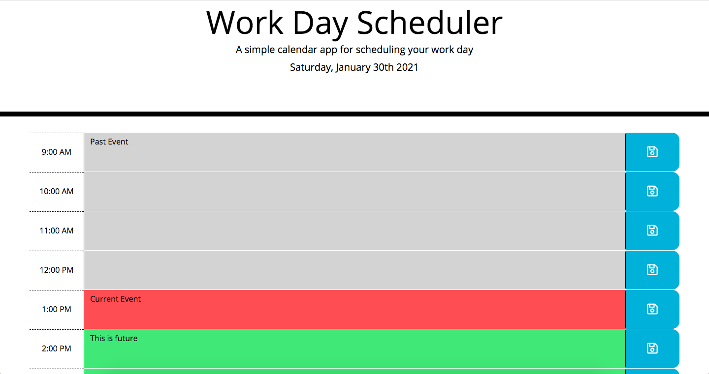

# Work Day Scheduler

## Description

The purpose of this project is to demonstrate my ability to use [jQuery](https://jquery.com/) to build a work day scheduler. This project features the use of Moment.js to retrieve the current date and hour which will then be compared to the time block to determine whether the time block is in the current hour, past hour(s), or future hour(s). It also features the use of saving events to local storage as well as retrieving those events.

Deployed Project: https://eroux13.github.io/work_day_scheduler

## How it Works

This application updates dynamically according to the current time. When a time block is in the past, the block turn grey. When the time block is in the current time, it updates to red. When it is a future time block, it updates to green. When the save button to the right of the time block is clicked on, the event entered will save to local storage.

